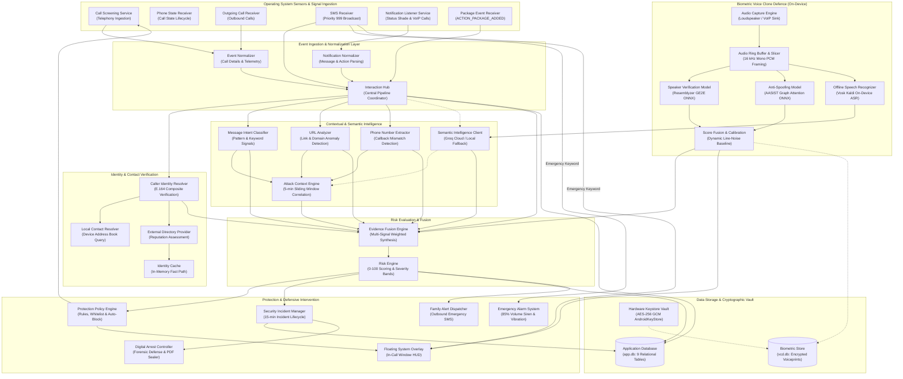

# VOCIS — Voice, Call & Interaction Sentinel

[-blue.svg)](https://developer.android.com)
[-green.svg)](https://developer.android.com)
[](https://kotlinlang.org)
[](https://onnxruntime.ai)
[](https://developer.android.com/training/articles/keystore)

**VOCIS (Voice, Call & Interaction Sentinel)** is an autonomous, on-device telecommunication security platform engineered for Android. It detects, screens, and neutralizes multi-vector social engineering attacks in real time—including **Digital Arrest scams**, **OTP harvesting**, **remote desktop hijackings**, and **generative AI voice cloning**.

---

## Table of Contents
1. [The Idea & Problem Statement](#the-idea--problem-statement)
2. [Core Novelty & Differentiators](#core-novelty--differentiators)
   - [One-Tap Direct Cyber Crime Cell Reporting (>75% Risk)](#-one-tap-direct-cyber-crime-cell-reporting-risk-score--75)
3. [System Architecture](#system-architecture)
4. [System Flow & Interactions](#system-flow--interactions)
5. [Technology Stack](#technology-stack)
6. [Phased Implementation Roadmap](#phased-implementation-roadmap)
7. [Security & Privacy Model](#security--privacy-model)
8. [Configuration & Getting Started](#configuration--getting-started)

---

## The Idea & Problem Statement

Modern smartphone users face complex, coordinated social engineering attacks that bypass conventional anti-spam caller ID filters:

1. **Digital Arrest & Authority Impersonation**: Scammers pose as police officers, CBI, ED, court officials, or telecom authorities, placing victims under false "digital arrest" via coercive audio/video calls to extort life savings.
2. **Coordinated Multi-Vector Scams**: Fraudsters orchestrate banking OTP SMS alerts, send phishing links, and instruct victims to install remote desktop APKs (*AnyDesk*, *TeamViewer*, *RustDesk*) while simultaneously engaging them in voice calls.
3. **Generative AI Voice Cloning**: Bad actors clone family members' voices with high fidelity using few-shot neural audio models to extort emergency ransom payments.
4. **Telecommunication Latency Constraints**: Standard telephony incoming calls must be evaluated in under **2000 milliseconds** before ringing, demanding zero-latency local intelligence without cloud delays.

**VOCIS solves this** by fusing native Android telephony call screening, high-priority SMS parsing, notification shade surveillance, hardware-backed cryptography, on-device neural voice clone defense, and emergency family SOS loops into an integrated mobile defense sentinel.

---

## Core Novelty & Differentiators

| Feature | Conventional Anti-Spam (Truecaller, etc.) | VOCIS Sentinel |
|---|---|---|
| **Detection Basis** | Static crowd-sourced caller ID lookup | **Multi-modal temporal attack correlation** across Calls + SMS + Notifications + Installed APKs |
| **Voice Clone Defence** | ❌ None (Relies purely on caller ID) | **On-Device 2D Neural Verification** (Resemblyzer GE2E + AASIST anti-spoofing) |
| **Biometric Privacy** | ❌ N/A | **Zero Cloud Biometrics**: Voiceprints stay on-device, encrypted in Hardware Keystore AES-256 GCM |
| **Decision Latency** | Cloud round-trip (500 ms – 3000 ms) | **$\le 1800\text{ ms}$ on-device fail-open timeout budget** |
| **Digital Arrest Defense**| ❌ None | **10-phase guided defense state machine + SHA-256 sealed forensic PDF dossier** |
| **Family Emergency SOS**| ❌ None | **Automated SMS dispatch (score > 50) + High-priority audio alarm siren loop (overrides DND)** |
| **Cyber Cell Reporting** | ❌ None | **One-Tap Direct Cyber Crime Cell Reporting** directly from the in-call overlay with full forensic dossier when risk score > 75% |

### Key Architectural Invariants
* **Fail-Open Invariant**: If analysis exceeds the $1800\text{ ms}$ budget or encounters system errors during call screening, the call is automatically allowed (`ALLOW_CALL`). Emergency and legitimate calls are never blocked by system failures.
* **Dual-Score 2D Fusion**: Speaker similarity and synthetic speech probability are **never averaged**. A clone is defined strictly by high speaker match ($\ge 0.75$) combined with high synthetic probability ($\ge \text{calibrated threshold}$).
* **Anti-Spam Alert Throttling**: Automated family emergency SMS alerts enforce strict 1-SMS-per-call idempotency and a global 5-minute ($300,000\text{ ms}$) cooldown.

---

### 🚨 One-Tap Direct Cyber Crime Cell Reporting (Risk Score > 75%)

A signature defense capability of VOCIS is **instantaneous, one-tap reporting to the Cyber Crime Cell** when an ongoing threat enters the **`CRITICAL` band (risk score $> 75\%$)** (e.g., active Digital Arrest intimidation, banking extortion, or deepfake voice clone):

1. **Zero-Friction In-Call HUD Prompt**:
   - The user immediately receives a prominent, high-contrast **"One-Tap Report to Cyber Crime Cell"** action directly on the floating in-call HUD overlay and incident alert dialog.
   - Designed for high-panic, coercive situations: victims under intense extortion do not need to remember emergency numbers, navigate external websites, or manually record caller details during an active attack.

2. **Automated Comprehensive Forensic Dossier**:
   With a single tap, VOCIS compiles and cryptographically packages the entire attack trail:
   * **Telecom & Caller Telemetry**: Verified E.164 phone number, carrier network metadata, spoof detection status, call start/end timestamps, and duration.
   * **Correlated Multi-Vector Evidence**: Exact timestamps of banking OTPs received within the 5-minute correlation window, detected remote desktop package identifiers (*AnyDesk*, *TeamViewer*, *RustDesk*), and phishing URLs.
   * **Verbatim Transcripts & Coercion Tactics**: Real-time speech transcripts captured by local on-device ASR, flagging explicit legal threats, fake warrants, and police/CBI/ED impersonation.
   * **Biometric Deepfake Telemetry**: Real-time AASIST synthetic probability scores and Resemblyzer speaker similarity metrics proving voice clone synthesis.
   * **SHA-256 Cryptographically Sealed PDF Dossier**: Immutable evidentiary report generated on-device via `DigitalArrestPdfGenerator` with tamper-evident digital digest verification.

3. **Instant Escalation & Account Freezing**:
   - **National Cyber Crime Helpline (1930)**: Pre-populates the national cyber fraud emergency dialer and incident summary with a single touch.
   - **National Cyber Crime Reporting Portal ([cybercrime.gov.in](https://cybercrime.gov.in))**: Formats structured complaint payloads ready for instantaneous submission to initiate golden-hour bank account freezing before illicit funds can be transferred.

---

## System Architecture

The following diagram illustrates the complete end-to-end component topology and data exchange contracts:



---

## System Flow & Interactions

```
1. Incoming Event (Call / SMS / Notification / Package Install)
         │
         ▼
2. Normalization Stage (EventNormalizer / NotificationNormalizer)
         │
         ▼
3. Sliding Attack Context (5-minute correlation window)
   ├── Active Banking OTP within 5 min? (+40 risk)
   ├── Remote Desktop (AnyDesk/TeamViewer) installed/active? (+60 risk)
   └── Phishing Link or Callback discrepancy? (+30 risk)
         │
         ▼
4. Biometric Voice Clone Defence (Active Calls)
   ├── Resemblyzer GE2E: Speaker Similarity (Who is speaking?)
   ├── AASIST: Synthetic Probability (Is it AI-generated speech?)
   └── Dynamic Line-Noise Calibration: Prevents false alarms on noisy lines
         │
         ▼
5. Evidence Fusion & Bayesian Scoring
   └── Clamped [0, 100] Risk Score categorized into 4 Severity Bands:
       • LOW (0-24)      ──► Silent Pass (MONITOR_ONLY)
       • ELEVATED (25-49) ──► Heads-Up Contextual Warning Card
       • HIGH (50-74)    ──► Silence Call Ringer + Family SOS SMS Alert
       • CRITICAL (75-100) ─► BLOCK_CALL + Siren Alarm + Forensic Incident
         │
         ▼
6. Incident Lifecycle & One-Tap Cyber Crime Cell Reporting (>75% Score)
   ├── Renders immediate "One-Tap Report to Cyber Crime Cell" action on in-call HUD
   ├── Auto-generates SHA-256 cryptographically sealed PDF evidence dossier
   └── Directly pre-populates Helpline 1930 & cybercrime.gov.in complaint payloads
```

---

## Technology Stack

### Android Core Platform & Architecture
* **Language**: Kotlin 2.0.0 (Coroutines, StateFlow, Structured Concurrency)
* **SDK Compatibility**: Min SDK 29 (Android 10), Target & Compile SDK 35 (Android 15)
* **Build System**: Gradle 8.7 with Gradle Version Catalogs (`libs.versions.toml`)
* **UI Toolkit**: Jetpack Compose with Material 3 Design System & System Window Overlays (`TYPE_APPLICATION_OVERLAY`)
* **Background Execution**: Android Telecom `CallScreeningService`, `NotificationListenerService`, Foreground Services (`FOREGROUND_SERVICE_PHONE_CALL`, `FOREGROUND_SERVICE_MICROPHONE`)

### Data Persistence & Hardware Cryptography
* **Dual Database Architecture (Room 2.6.1 + SQLite + KSP)**:
  * `app.db` (9 tables): `interactions`, `security_events`, `security_incidents`, `caller_identities`, `protection_policies`, `attack_contexts`, `audit_logs`, `family_contacts`, `threat_rules`.
  * `vcd.db` (2 tables): `contact_voiceprints`, `vcd_call_history`.
* **Hardware Cryptographic Keyring**: `AndroidKeyStore` AES-256 GCM (`AES/GCM/NoPadding`) with 12-byte initialization vectors and hardware-bound Secure Element key alias (`vcd_voiceprint_master_key`).
* **Forensic Evidence Sealing**: SHA-256 cryptographic digest verification over incident timelines and PDF document artifacts.

### Artificial Intelligence, Biometrics & Audio Processing
* **On-Device Neural Runtime**: Microsoft ONNX Runtime Android (`onnxruntime-android:1.20.0`)
* **Neural Speaker Recognition**: Resemblyzer GE2E (Generalized End-to-End loss) 256-dimensional unit embedding extractor (`voice_encoder.onnx`)
* **Neural Anti-Spoofing**: AASIST (Audio Anti-Spoofing Integrated with Spectral and Temporal Graph Attention Networks) processing raw waveforms (`aasist_spoof_detector.onnx`)
* **Offline Speech Recognition**: Vosk Kaldi speech recognizer (`vosk-android:0.3.45` + `vosk-model-small-en-us`) running 100% on-device
* **Semantic Threat Intelligence**: Cloud LLM via Groq LPU API (`groq/compound-mini` / `llama-3.1-8b-instant`) with automatic fallback to local 60+ regex heuristic engine (`LocalHeuristicScamClassifier`)
* **Audio Engineering**: 16 kHz Mono PCM audio capture, 160,000-sample circular ring buffer, 64,600-sample sliding verification window with 48,000-sample hops.

### Peer-to-Peer & Telecom Networking
* **Local Peer Discovery**: Multicast DNS (mDNS `_vocis._tcp.` on TCP port 47821) via Android `NsdManager`
* **VoIP Media Engine**: WebRTC P2P mesh (`stream-webrtc-android:1.3.4`) with line-delimited TCP signaling
* **HTTP & Gateway Transport**: OkHttp 4.12.0 with TLS 1.3 for cloud API communication and TextBee emergency SMS gateway fallback

---

## Security & Privacy Model

1. **Zero Cloud Biometrics**: Voiceprints, raw audio buffers, and speaker embeddings **never leave the local device**. All biometric calculations run on-device via ONNX Runtime.
2. **Hardware Key Isolation**: Voiceprints in `vcd.db` are encrypted using AES-256 GCM keys generated directly inside the device's Secure Element (AndroidKeyStore). The key cannot be extracted even with root privileges.
3. **Fail-Open Operating Invariant**: To guarantee that emergency services or legitimate personal calls are never dropped by technical faults, all call screening executes within a hard-bounded $1800\text{ ms}$ coroutine timeout. Any timeout or exception immediately falls open to `ALLOW_CALL`.
4. **Offline Resilience**: VOCIS operates fully autonomously without internet connectivity. When offline, linguistic analysis switches from Groq to the built-in, on-device regex engine (`LocalHeuristicScamClassifier`).

---

## Configuration & Getting Started

### Prerequisites
* **Android Studio Ladybug (2024.2+)** or **Android Studio Iguana+**
* **JDK 17**
* **Android SDK Platform 35** (Build Tools 35.0.0)
* Physical Android device running **Android 10+ (API 29+)** with phone call & SMS capability.

### 1. Clone & Configure Secrets
Create a `local.properties` file in the project root to configure local Android SDK and optional cloud LLM keys:

```properties
sdk.dir=C\:\\Users\\<user>\\AppData\\Local\\Android\\Sdk
GROQ_API_KEY=gsk_your_groq_api_key_here
```
*(Note: `local.properties` is strictly gitignored to protect secrets from being committed).*

### 2. Build & Test
Execute automated test suites via the Gradle wrapper:

```bash
# Run unit tests across all domain, crypto, and intelligence engines
./gradlew test

# Assemble debug APK
./gradlew assembleDebug
```

---

## License & Attribution
VOCIS is developed as an on-device mobile cyber defense solution for scam prevention and digital safety.
All rights reserved.
